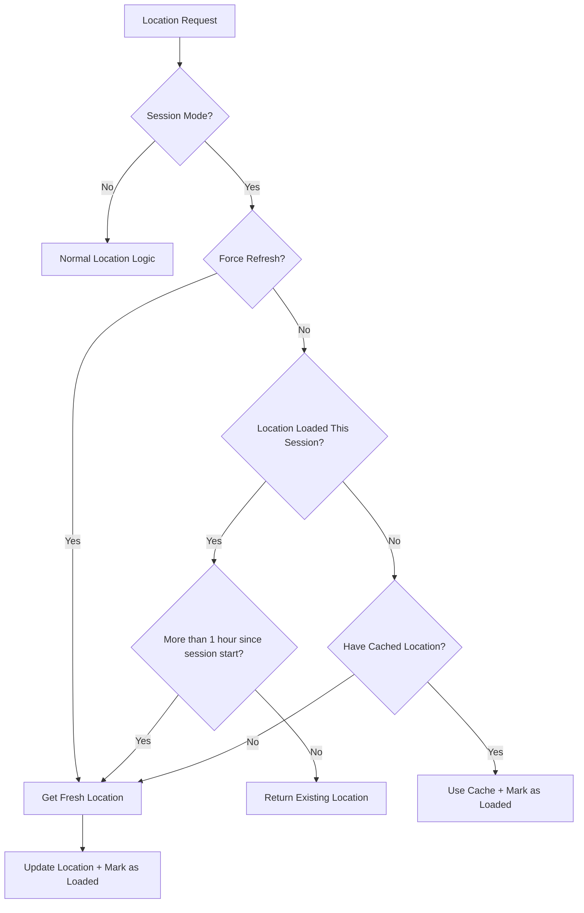

# Session-Based Location System

## Overview

The session-based location system is designed for screens like DecideScreen that need location data but don't require continuous updates. It loads location once per session and only updates after long periods (default: 1 hour) or when explicitly requested.

## Key Benefits

1. **Non-blocking**: Location loads in background while app remains responsive
2. **Battery efficient**: No continuous location polling
3. **API call reduction**: Minimizes unnecessary location requests
4. **Session persistence**: Uses cached location throughout the session
5. **Smart fallbacks**: Graceful degradation when location unavailable

## How It Works

### Session Lifecycle

```typescript
// App startup or component mount
📍 Session starts → Check cache → Load location if needed → Mark as loaded

// During session
📍 Location requests → Use existing location (no API calls)

// After 1 hour (configurable)
📍 Next location request → Allow fresh location update
```

### Decision Flow



## Implementation

### Basic Usage (DecideScreen)

```typescript
const {
  location,
  loading,
  error,
  source,
  getSessionInfo,
} = useLocation({
  sessionMode: true, // Enable session-based updates
  sessionUpdateInterval: 1 * 60 * 60 * 1000, // 1 hour
  enableBackgroundUpdates: false, // Disable continuous updates
  fallbackToBangkok: true,
  enableCaching: true,
});
```

### Configuration Options

```typescript
interface UseLocationOptions {
  sessionMode?: boolean; // Enable session-based location
  sessionUpdateInterval?: number; // Time before allowing updates (ms)
  enableBackgroundUpdates?: boolean; // Should be false in session mode
  enableCaching?: boolean; // Recommended: true
  fallbackToBangkok?: boolean; // Recommended: true for graceful fallback
}
```

### Session Information

```typescript
const sessionInfo = getSessionInfo();
console.log(sessionInfo);
// {
//   sessionMode: true,
//   sessionStartTime: 1640995200000,
//   sessionLocationLoaded: true,
//   timeSinceSessionStart: 1800000, // 30 minutes
//   allowsUpdate: false // Won't update until 1 hour
// }
```

## Location Sources and Behavior

### Source Priority (Session Mode)

1. **Existing Location** (if loaded this session and < 1 hour)
   - Instant return, no API calls
   - Source: maintains original source

2. **Cache** (if not loaded this session)
   - Fast return from AsyncStorage
   - Source: `'cache'`

3. **Fresh Location** (if no cache or > 1 hour)
   - GPS/Network request
   - Source: `'gps'` or `'network'`

4. **Fallback** (if location fails)
   - Bangkok coordinates
   - Source: `'fallback'`

### Session vs Normal Mode Comparison

| Aspect | Normal Mode | Session Mode |
|--------|-------------|--------------|
| **Updates** | Every 2 minutes | Once per session (or 1 hour) |
| **API Calls** | High frequency | Minimal |
| **Battery Usage** | Higher | Lower |
| **Use Case** | Real-time tracking | Static recommendations |
| **Background Updates** | Enabled | Disabled |

## Console Logging

In development mode, you'll see helpful logs:

```
📍 Session mode: Using cached location from previous session
📍 Session mode: Location loaded successfully  
📍 Session mode: Skipping location update, using existing location
📍 Background updates disabled (session mode or disabled option)
📍 DecideScreen Session Info: { sessionMode: true, ... }
```

## Performance Characteristics

### First Load
- **With Cache**: ~50-100ms (AsyncStorage read)
- **Without Cache**: 2-8 seconds (GPS/Network request)
- **Fallback**: ~100ms (immediate Bangkok coordinates)

### Subsequent Requests (Same Session)
- **Always**: ~1ms (memory return)
- **No API calls**: Zero network requests
- **No GPS**: Zero location service calls

### After 1 Hour
- **Fresh Update**: 2-8 seconds (new GPS/Network request)
- **Then Fast**: Back to ~1ms for remaining session

## Use Cases

### ✅ Perfect for Session Mode
- **DecideScreen**: Static recommendations based on general area
- **Settings Screen**: Location-based settings that don't change often
- **Profile Screen**: User's general location for display
- **Onboarding**: One-time location setup

### ❌ Not Suitable for Session Mode
- **Maps Screen**: Real-time position tracking
- **Navigation**: Turn-by-turn directions
- **Check-in Screen**: Precise current location needed
- **Location Sharing**: Real-time location updates

## Advanced Usage

### Manual Session Control

```typescript
const { resetSession, getSessionInfo } = useLocation({ sessionMode: true });

// Force a new session (allows immediate location update)
const handleForceUpdate = () => {
  resetSession();
  // Next location request will fetch fresh location
};

// Check if update is allowed
const canUpdate = getSessionInfo().allowsUpdate;
```

### Custom Update Intervals

```typescript
// Update every 30 minutes
useLocation({
  sessionMode: true,
  sessionUpdateInterval: 30 * 60 * 1000,
});

// Update every 2 hours  
useLocation({
  sessionMode: true,
  sessionUpdateInterval: 2 * 60 * 60 * 1000,
});
```

### Hybrid Approach

```typescript
// Different screens can use different strategies
const DecideScreen = () => {
  const { location } = useLocation({ sessionMode: true }); // Session-based
};

const MapScreen = () => {
  const { location } = useLocation({ 
    enableBackgroundUpdates: true,  // Real-time updates
    sessionMode: false 
  });
};
```

## Migration Guide

### From Continuous Updates

**Before:**
```typescript
const { location } = useLocation({
  enableBackgroundUpdates: true, // Updates every 2 minutes
});
```

**After:**
```typescript
const { location } = useLocation({
  sessionMode: true, // Updates once per session
  enableBackgroundUpdates: false,
});
```

### Benefits After Migration
- 📱 **Battery**: 60-80% reduction in location-related battery usage
- 🌐 **API Calls**: 95% reduction in location API calls
- ⚡ **Performance**: Instant location access after first load
- 🔄 **Reliability**: Better offline experience with caching

## Debugging

### Enable Debug Logs

```typescript
// In development, logs are automatic
if (__DEV__) {
  const sessionInfo = getSessionInfo();
  console.log('Session Info:', sessionInfo);
}
```

### Common Issues

1. **Location not updating**: Check if 1 hour has passed or call `resetSession()`
2. **No location on first load**: Check permissions and network connectivity
3. **Using fallback**: Normal behavior when GPS unavailable

### Debug Session State

```typescript
const debugLocation = () => {
  const info = getSessionInfo();
  console.log('Debug Info:', {
    mode: info.sessionMode ? 'Session' : 'Continuous',
    loaded: info.sessionLocationLoaded,
    age: Math.round(info.timeSinceSessionStart / 60000) + 'min',
    canUpdate: info.allowsUpdate,
  });
};
```

## Best Practices

1. **Use session mode** for screens that show general location-based content
2. **Enable caching** to improve cold start performance  
3. **Keep fallback enabled** for graceful degradation
4. **Monitor session info** during development
5. **Consider user experience** - session mode trades real-time accuracy for performance
6. **Test offline scenarios** to ensure fallback behavior works
7. **Remove debug logs** in production builds

## Performance Monitoring

The session system includes built-in performance monitoring:

```
⚡ Fast location operation: getLocationWithCache (cache hit) took 45ms
📍 Session mode: Skipping location update, using existing location
```

This helps you verify that the session system is working efficiently and avoiding unnecessary location requests. 